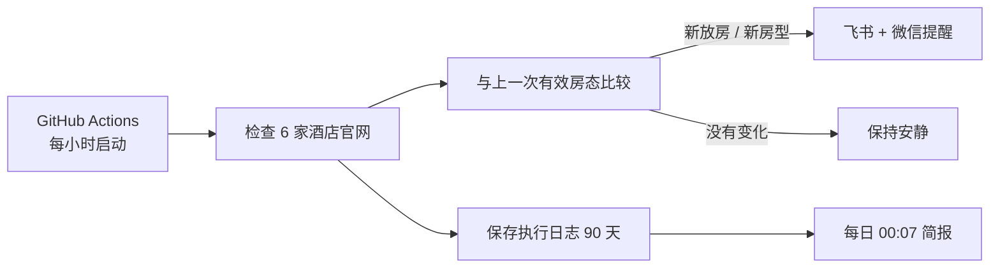

<div align="center">

# 🏨 LakeWatch

### Lake Tekapo / Mt Cook 酒店放房监控

每小时自动检查 6 家酒店官网。只在真正出现新房时提醒，不用守着网页反复刷新。

[](https://github.com/biblioth/tekapo-hotel-monitor/actions/workflows/hourly-monitor.yml)
[](https://github.com/biblioth/tekapo-hotel-monitor/actions/workflows/daily-summary.yml)
[](https://www.python.org/)
[](#为什么是免费的)

**安静监控 · 官网直查 · 飞书 / 微信双推送 · 每日简报**

</div>

---

## 它解决什么问题

热门日期的酒店房源可能随时因取消订单重新放出。LakeWatch 在云端持续帮你检查，只有发现值得行动的变化才发送飞书和微信消息：

- **新放房**：酒店从无房变为有房。
- **新房型**：已有房源时又出现此前没有的房型。
- **不打扰**：价格变化、持续有房、持续无房都不会提醒。
- **不误报**：官网超时、改版或验证码会记录为异常，不会被当成“无房”。

第一次运行只建立房态基线，不发送提醒。

## 当前监控行程

| 项目 | 配置 |
| --- | --- |
| 入住 | **2027-02-05** |
| 退房 | **2027-02-06** |
| 住客 | **2 位成人** |
| 频率 | **每小时一次** |
| 数据源 | **酒店官网 / 官方预订引擎** |
| 提醒渠道 | **飞书机器人 + PushPlus 微信服务号** |
| 每日简报 | **北京时间每天 00:07** |

监控酒店：

1. Ranginui at Lake Tekapo
2. Lakeview Tekapo
3. Grand Suites Lake Tekapo
4. Galaxy Boutique Hotel
5. Peppers Bluewater Resort Lake Tekapo
6. The Hermitage Hotel Mt Cook

> 原需求中的 “Herimage Mt Cook” 已按 **The Hermitage Hotel Mt Cook** 处理。

## 收到的提醒长这样

```text
🔔 Lake Tekapo 捡漏

Peppers Bluewater Resort 放房
房型：Deluxe Lake View Room
价格：NZ$xxx
可免费取消至：2027/02/03 xx:xx
渠道：官网

建议：⭐⭐⭐⭐⭐ 立即订
```

每天还会收到一条简短汇总，包含前一天的执行次数、异常数、房态变化和提醒次数。即使全天没有新房，也能确认服务仍在正常工作。

## 工作方式



系统会保存最后一次有效快照，并把提醒同时交给飞书和 PushPlus。单个渠道临时失败不会挡住另一个渠道；如果两个渠道都失败，消息会保留在待发队列并在后续执行中重试。每个渠道的结果都会写入执行日志。

## 为什么是免费的

本项目直接读取酒店公开的官网预订页，不依赖 SerpApi 或其他付费酒店搜索 API。它运行在**公开 GitHub 仓库**的标准 GitHub Actions runner 上，因此不消耗付费 Actions 分钟，Mac 关机后也会继续执行。

云端检查直接使用 GitHub Ubuntu runner 预装的 Google Chrome，不在每个小时重复下载浏览器或通过 Ubuntu 软件源安装系统依赖，从而减少外部镜像波动导致的超时。

需要了解的边界：

- 仓库代码、酒店名单和入住日期是公开的。
- 飞书 Webhook、签名密钥和 PushPlus 消息 Token 存放在 GitHub Actions Secrets 中，不会出现在代码里。
- GitHub 定时任务可能在高峰期延迟几分钟，不适合秒级抢房。
- 每月心跳工作流会保持定时任务活跃，避免公开仓库长期无提交后被暂停。

## 云端部署

1. 创建一个 **Public** GitHub 仓库并上传本项目；不要提交 `.env`。
2. 进入 `Settings → Secrets and variables → Actions`，添加：
   - `FEISHU_WEBHOOK_URL`
   - `FEISHU_WEBHOOK_SECRET`
   - `PUSHPLUS_TOKEN`
   - `PUSHPLUS_TOPIC`（当前群组编码：`lakewatch20270205`）
3. 进入 `Actions → Hourly hotel monitor → Run workflow`，手动执行一次以建立基线。
4. 检查 Actions 页面是否出现绿色成功状态。

随后：

- `Hourly hotel monitor` 在每小时 UTC 第 17 分检查房态。
- `Daily hotel summary` 在北京时间每天 00:07 发送前一日简报。
- 每次 JSONL 日志会作为 GitHub Actions Artifact 保存 90 天。
- SQLite 状态通过 Actions cache 传递到下一次执行。

## 本地运行（可选）

云端版本无需保持电脑开机。只有需要本地调试或自建部署时，才需要 Docker：

```bash
cp .env.example .env
# 在 .env 中填写飞书 Webhook、签名密钥和 PushPlus Token
docker compose up -d --build
```

本地服务默认提供：

| 接口 | 用途 |
| --- | --- |
| `GET /healthz` | 存活检查 |
| `GET /status` | 查看下次执行时间、最近执行和酒店快照 |
| `GET /runs?limit=24` | 查看每小时执行历史 |
| `POST /check` | 手动触发检查 |

持久化数据：

- `data/monitor.db`：执行记录、酒店观察、有效快照和待发提醒。
- `data/monitor.jsonl`：按 UTC 日期轮转的逐行 JSON 日志。

## 本地开发

```bash
python -m venv .venv
source .venv/bin/activate
pip install -e '.[dev]'
python -m playwright install chromium
pytest
```

## 使用提示

- 酒店官网可能改版、限流或弹出验证码；系统会记录异常，并在下个小时自动重试。
- 请保持每小时一次的友好频率，避免对酒店官网造成不必要的请求。
- 房态和价格以最终预订页面为准；收到提醒后仍应尽快打开官网确认并下单。

---

<div align="center">

**LakeWatch — 把时间留给旅行，而不是刷新网页。**

</div>
