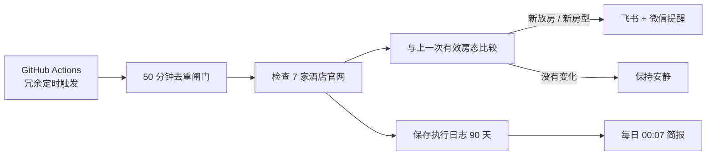

<div align="center">

# 🏨 LakeWatch

### 新西兰酒店官网放房监控

每小时自动检查 7 家酒店官网。每家酒店可使用独立入住日期，只在真正出现新房时提醒。

[](https://github.com/biblioth/tekapo-hotel-monitor/actions/workflows/hourly-monitor.yml)
[](https://github.com/biblioth/tekapo-hotel-monitor/actions/workflows/daily-summary.yml)
[](https://www.python.org/)
[](#更新日志)
[](#为什么是免费的)

**安静监控 · 官网直查 · 飞书 / 微信双推送 · 每日简报**

</div>

---

## 它解决什么问题

热门日期的酒店房源可能随时因取消订单重新放出。LakeWatch 在云端持续帮你检查，只有发现值得行动的变化才发送飞书和微信消息：

- **新放房**：酒店从无房变为有房。
- **新房型**：已有房源时又出现此前没有的房型。
- **不打扰**：价格变化、持续有房、持续无房都不会提醒。
- **不误报**：官网超时、改版或验证码会记录为异常，不会被当成“无房”。

第一次运行只建立房态基线，不发送提醒。

## 当前监控行程

| 行程 | 酒店 | 入住 → 退房 | 住客 |
| --- | --- | --- | --- |
| Lake Tekapo / Mt Cook | 6 家 | **2027-02-05 → 2027-02-06** | 2 位成人 |
| Hahei Beach | 1 家 | **2027-02-12 → 2027-02-13** | 2 位成人 |

| 服务 | 配置 |
| --- | --- |
| 频率 | **每小时一次** |
| 数据源 | **酒店官网 / 官方预订引擎** |
| 提醒渠道 | **飞书机器人 + PushPlus 微信服务号** |
| 每日简报 | **北京时间每天 00:07** |

监控酒店：

1. Ranginui at Lake Tekapo
2. Lakeview Tekapo
3. Grand Suites Lake Tekapo
4. Galaxy Boutique Hotel
5. Peppers Bluewater Resort Lake Tekapo
6. The Hermitage Hotel Mt Cook
7. Tasman Holiday Parks Hahei Beach（原 Hahei Beach Resort）

> 原需求中的 “Herimage Mt Cook” 已按 **The Hermitage Hotel Mt Cook** 处理。

## 收到的提醒长这样

```text
🔔 LakeWatch 酒店捡漏

Peppers Bluewater Resort 放房
房型：Deluxe Lake View Room
价格：NZ$xxx
可免费取消至：2027/02/03 xx:xx
渠道：官网

建议：⭐⭐⭐⭐⭐ 立即订
```

每天还会收到一条简短汇总，包含前一天的执行次数、异常数、房态变化和提醒次数。即使全天没有新房，也能确认服务仍在正常工作。

## 工作方式



系统会保存最后一次有效快照，并把提醒同时交给飞书和 PushPlus。单个渠道临时失败不会挡住另一个渠道；如果两个渠道都失败，消息会保留在待发队列并在后续执行中重试。每个渠道的结果都会写入执行日志。

## 为什么是免费的

本项目直接读取酒店公开的官网预订页，不依赖 SerpApi 或其他付费酒店搜索 API。它运行在**公开 GitHub 仓库**的标准 GitHub Actions runner 上，因此不消耗付费 Actions 分钟，Mac 关机后也会继续执行。

云端检查直接使用 GitHub Ubuntu runner 预装的 Google Chrome，不在每个小时重复下载浏览器或通过 Ubuntu 软件源安装系统依赖，从而减少外部镜像波动导致的超时。

需要了解的边界：

- 仓库代码、酒店名单及每家酒店的入住日期是公开的。
- 飞书 Webhook、签名密钥和 PushPlus 消息 Token 存放在 GitHub Actions Secrets 中，不会出现在代码里。
- GitHub 定时事件可能在高峰期延迟或被丢弃，不适合要求严格整点或秒级抢房。本项目每 5 分钟提供一次轻量候选触发，并用 50 分钟去重闸门把真实官网检查限制为约每小时一次。
- 每月心跳工作流会保持定时任务活跃，避免公开仓库长期无提交后被暂停。

## 云端部署

1. 创建一个 **Public** GitHub 仓库并上传本项目；不要提交 `.env`。
2. 进入 `Settings → Secrets and variables → Actions`，添加：
   - `FEISHU_WEBHOOK_URL`
   - `FEISHU_WEBHOOK_SECRET`
   - `PUSHPLUS_TOKEN`
   - `PUSHPLUS_TOPIC`（当前群组编码：`lakewatch20270205`）
3. 进入 `Actions → Hourly hotel monitor → Run workflow`，手动执行一次以建立基线。
4. 检查 Actions 页面是否出现绿色成功状态。

随后：

- `Hourly hotel monitor` 每 5 分钟尝试唤醒一次；轻量闸门会在安装依赖和启动浏览器前跳过距上次真实检查不足 50 分钟的候选事件，因此官网通常仍只检查约 1 次。
- `Daily hotel summary` 在北京时间每天 00:07 发送前一日简报。
- 每次 JSONL 日志会作为 GitHub Actions Artifact 保存 90 天。
- SQLite 状态通过 Actions cache 传递到下一次执行。

## 本地运行（可选）

云端版本无需保持电脑开机。只有需要本地调试或自建部署时，才需要 Docker：

```bash
cp .env.example .env
# 在 .env 中填写飞书 Webhook、签名密钥和 PushPlus Token
docker compose up -d --build
```

本地服务默认提供：

| 接口 | 用途 |
| --- | --- |
| `GET /healthz` | 存活检查 |
| `GET /status` | 查看下次执行时间、最近执行和酒店快照 |
| `GET /runs?limit=24` | 查看每小时执行历史 |
| `POST /check` | 手动触发检查 |

持久化数据：

- `data/monitor.db`：执行记录、酒店观察、有效快照和待发提醒。
- `data/monitor.jsonl`：按 UTC 日期轮转的逐行 JSON 日志。

## 本地开发

```bash
python -m venv .venv
source .venv/bin/activate
pip install -e '.[dev]'
python -m playwright install chromium
pytest
```

## 使用提示

- 酒店官网可能改版、限流或弹出验证码；系统会记录异常，并在下个小时自动重试。
- 请保持每小时一次的友好频率，避免对酒店官网造成不必要的请求。
- 房态和价格以最终预订页面为准；收到提醒后仍应尽快打开官网确认并下单。

## 更新日志

### v1.1.6 · 2026-09-03

- 针对 GitHub 原生定时事件集中延迟、丢弃导致每日检查次数骤减的问题，将候选唤醒频率提高到每 5 分钟一次。
- 将 50 分钟去重闸门提前到依赖安装和浏览器启动之前；冗余候选只读取持久化时间戳，不访问任何酒店官网。
- 合并原有 4 个小时级工作流，避免备份任务集中到达时排队，同时保持公开仓库标准 runner 的免费运行方式。

### v1.1.5 · 2026-09-01

- 重写飞书和微信日报：先给出明确结论，再说明自动检查次数、计划次数、差额、检查质量、房态结果以及是否需要操作。
- 将每家酒店的官网读取失败次数分别列出，避免把“异常记录数”误解成“异常酒店数”或“整个服务故障”。
- 从现在起区分自动定时检查和手动验证，手动排查不再抬高日报中的自动执行次数。
- 自动执行不足 20 次时明确标记“监控次数不足”，不再用模糊的“执行 N 次”让人自行判断是否正常。
- 将 4 个错峰时间拆成彼此独立的定时工作流，共用同一检查核心与去重闸门，进一步降低单个 GitHub 定时入口漏触发的影响。

### v1.1.4 · 2026-08-31

- 修复 GitHub 原生定时事件被延迟或丢弃后、每天只执行 2–5 次的问题。
- 每小时改为 4 次错峰触发机会，并增加基于持久化执行记录的 50 分钟去重闸门；提高触发成功率，同时避免频繁请求酒店官网。
- 手动运行不受去重闸门限制；被跳过的冗余事件不计入执行日志和日报，也不重复保存状态或日志附件。
- 自动关闭 Ranginui 官网新增的公告弹窗，避免弹窗遮挡日期控件后产生虚假异常。

### v1.1.3 · 2026-08-25

- 官网检查由 2 次尝试提升为 3 次，并使用 5 秒、10 秒的递增等待，降低瞬时断网和官网短暂限流造成的异常。
- Hahei 单次动态加载等待由 30 秒调整为 20 秒，以相近的最坏耗时换取更多独立重试机会。
- 新增重试等待日志，便于区分官网持续故障与下一次尝试即可恢复的网络抖动。

### v1.1.2 · 2026-08-24

- 优化飞书和微信日报文案，将重复异常记录与受影响酒店数量分开展示。
- 单家酒店多次异常时明确提示“仅涉及 1 家”并显示酒店简称，避免误解为整个监控服务异常。
- 无异常的日报改为“全部正常”，微信通知标题也会直接显示异常范围，无需点开确认。

### v1.1.1 · 2026-08-24

- 优化 Hahei 的 Newbook 动态页面识别：不再固定等待 4.5 秒，而是最长等待 30 秒直至出现明确房态。
- 补充最低入住晚数、建议更换日期等无房提示，减少官网文案变化造成的技术异常。
- 异常日志新增页面状态、查询地址和精简页面摘要，便于区分加载延迟、官网改版与真实无房。

### v1.1.0 · 2026-08-19

- 新增 **Tasman Holiday Parks Hahei Beach** 官网监控，行程为 2027-02-12 至 2027-02-13。
- 支持为每家酒店单独配置入住日期、退房日期和住客人数；原有 6 家酒店行程保持不变。
- 接入 Hahei 使用的 Newbook 官方预订引擎；只有真正出现 `Book now` 的房型才判定为可订，两晚起订等限制不会误报。
- 提醒消息会显示发生变化酒店对应的行程日期，并将通知标题统一为 **LakeWatch 酒店捡漏**。
- 云端检查改用 GitHub runner 预装的 Google Chrome，移除容易受软件源波动影响的每小时系统依赖安装。
- 监控范围由 6 家扩展至 7 家，继续保留每小时日志、每日简报、飞书与微信双渠道提醒。

### v1.0.0 · 2026-08-13

- LakeWatch 首个可用版本上线，覆盖 Lake Tekapo / Mt Cook 的 6 家酒店官网。
- 建立“首次运行只保存基线、仅新放房或新房型提醒”的安静监控机制。
- 支持飞书机器人和 PushPlus 微信服务号双渠道推送。
- 使用 GitHub Actions 免费云端定时运行，并保存执行日志与每日简报。

---

<div align="center">

**LakeWatch — 把时间留给旅行，而不是刷新网页。**

</div>
