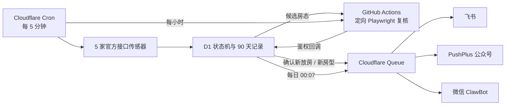

<div align="center">

# 🏨 LakeWatch

### 新西兰酒店官网放房监控

云端持续检查 7 家酒店官网：5 家官方接口每 5 分钟检查，2 家浏览器酒店每小时检查。每家酒店可使用独立入住日期，只在真正出现新房时提醒。

[](https://github.com/biblioth/tekapo-hotel-monitor/actions/workflows/tests.yml)
[](https://github.com/biblioth/tekapo-hotel-monitor/actions/workflows/cloudflare-health.yml)
[](https://lakewatch-sensor.spicyao-lakewatch.workers.dev/health)
[](https://www.python.org/)
[](#更新日志)
[](#为什么是免费的)

**安静监控 · 官网直查 · 飞书 / 微信公众号 / 微信 ClawBot · 每日简报**

</div>

---

## 它解决什么问题

热门日期的酒店房源可能随时因取消订单重新放出。LakeWatch 在云端持续帮你检查，只有发现值得行动的变化才发送飞书和微信消息：

- **新放房**：酒店从无房变为有房。
- **新房型**：已有房源时又出现此前没有的房型。
- **不打扰**：价格变化、持续有房、持续无房都不会提醒。
- **不误报**：官网超时、改版或验证码会记录为异常，不会被当成“无房”。

第一次运行只建立房态基线，不发送提醒。

## 当前监控行程

| 行程 | 酒店 | 入住 → 退房 | 住客 |
| --- | --- | --- | --- |
| Lake Tekapo / Mt Cook | 6 家 | **2027-02-05 → 2027-02-06** | 2 位成人 |
| Hahei Beach | 1 家 | **2027-02-12 → 2027-02-13** | 2 位成人 |

| 服务 | 配置 |
| --- | --- |
| 频率 | **5 家每 5 分钟 + 2 家每小时** |
| 数据源 | **酒店官网 / 官方预订引擎** |
| 提醒渠道 | **飞书机器人 + PushPlus 微信公众号 + 微信 ClawBot** |
| 每日简报 | **北京时间每天 00:07** |
| 生产状态 | **Cloudflare 主监控已启用；旧 GitHub 定时任务由开关跳过** |

监控酒店：

1. Ranginui at Lake Tekapo
2. Lakeview Tekapo
3. Grand Suites Lake Tekapo
4. Galaxy Boutique Hotel
5. Peppers Bluewater Resort Lake Tekapo
6. The Hermitage Hotel Mt Cook
7. Tasman Holiday Parks Hahei Beach（原 Hahei Beach Resort）

> 原需求中的 “Herimage Mt Cook” 已按 **The Hermitage Hotel Mt Cook** 处理。

## 收到的提醒长这样

```text
🔔 Peppers Bluewater 重新有房
2027/2/5–2027/2/6 · Deluxe Lake View Room
NZ$420 · 免费取消至 2027/2/3
立即预订：https://酒店官网预订链接
```

每天还会收到一条简短汇总：

```text
📊 LakeWatch 日报｜2026-09-16
✅ 高频监控正常｜未发现新房
传感器周期 288/288 次｜酒店探测 1440 次
```

即使全天没有新房，也能确认服务仍在正常工作。官网异常只写入日志和次日日报，不会另外发送即时故障提醒；只有真正发现新房才会立即通知。

## 工作方式



Cloudflare Worker 负责高频传感、状态比较、日报和通知队列。官方接口出现候选房态时，只启动对应酒店的浏览器复核；Lakeview 和 Galaxy 两家纯浏览器酒店每小时定向检查。D1 是唯一状态源，只有浏览器确认后的变化才能进入通知队列。

飞书、PushPlus 公众号和 ClawBot 分别记录投递结果并独立重试，一个渠道失败不会挡住其他渠道。`/health` 会检查传感器新鲜度、浏览器回调、待验证事件和通知积压，GitHub 的外部健康看门狗每小时从 Cloudflare 之外进行探测。

## 为什么是免费的

本项目直接读取酒店公开的官网预订页，不依赖 SerpApi 或其他付费酒店搜索 API。高频部分运行在 Cloudflare Workers、D1 和 Queues；浏览器复核使用**公开 GitHub 仓库**的标准 GitHub Actions runner。Mac 关机后两部分都会继续运行。

按当前频率和数据量，设计目标是在 Cloudflare Free 与公开仓库 GitHub Actions 免费范围内运行。Cloudflare 或 GitHub 未来调整额度时仍需重新核对；可参考 [Workers 限额](https://developers.cloudflare.com/workers/platform/limits/)、[D1 定价](https://developers.cloudflare.com/d1/platform/pricing/) 和 [GitHub Actions 计费说明](https://docs.github.com/en/billing/concepts/product-billing/github-actions)。

需要了解的边界：

- 仓库代码、酒店名单及每家酒店的入住日期是公开的。
- 飞书、PushPlus、GitHub 和回调凭据保存在 Worker Secrets 或 GitHub Actions Secrets 中，不会提交到仓库。
- Cloudflare Cron 可能存在短暂调度延迟；酒店官网也可能限流、改版或启用验证码，因此本项目追求可靠捡漏，不承诺秒级发现。
- GitHub Actions 只承担按酒店触发的 Playwright 复核和外部健康检查；旧版整站小时监控保留为回滚路径，生产环境不会执行。

## 云端部署

当前仓库已经完成生产部署。下面是新环境或 Fork 的最短配置路径，完整命令、迁移和回滚说明见 [`cloudflare/README.md`](cloudflare/README.md)。

1. 创建公开 GitHub 仓库，不要提交 `.env`、Token 或 Webhook。
2. 在 `cloudflare/` 中安装依赖并登录 Wrangler：

   ```bash
   npm ci
   npx wrangler login
   ```

3. 创建 D1 数据库、通知队列和死信队列，将实际 D1 ID 写入 `wrangler.jsonc`，再执行 `schema.sql`。
4. 用 `wrangler secret put` 配置：
   - `ADMIN_TOKEN`
   - `VALIDATION_TOKEN`
   - `GITHUB_TOKEN`
   - `FEISHU_WEBHOOK_URL`
   - `FEISHU_WEBHOOK_SECRET`
   - `PUSHPLUS_TOKEN`
   - `PUSHPLUS_TOPIC`
5. 在 GitHub Actions Secrets 配置 `CLOUDFLARE_VALIDATION_URL` 和 `CLOUDFLARE_VALIDATION_TOKEN`。
6. 部署 Worker，确认 `/health` 返回 `mode: active` 和 `ok: true`。
7. 在 `wrangler.jsonc` 中将 `PUSHPLUS_CHANNELS` 设为 `wechat,clawbot`；将 GitHub 仓库变量 `CLOUDFLARE_PRIMARY` 设为 `true`。

生产配置使用 `SHADOW_MODE=false`。回滚时先把 Worker 改回 `SHADOW_MODE=true` 并部署，再把 `CLOUDFLARE_PRIMARY` 改为 `false`，旧 GitHub 小时监控即可接管。

## 本地运行（可选）

云端版本无需保持电脑开机。只有需要本地调试或自建部署时，才需要 Docker：

```bash
cp .env.example .env
# 在 .env 中填写飞书 Webhook、签名密钥和 PushPlus Token
docker compose up -d --build
```

本地服务默认提供：

| 接口 | 用途 |
| --- | --- |
| `GET /healthz` | 存活检查 |
| `GET /status` | 查看下次执行时间、最近执行和酒店快照 |
| `GET /runs?limit=24` | 查看每小时执行历史 |
| `POST /check` | 手动触发检查 |

持久化数据：

- `data/monitor.db`：执行记录、酒店观察、有效快照和待发提醒。
- `data/monitor.jsonl`：按 UTC 日期轮转的逐行 JSON 日志。

## 本地开发

```bash
python -m venv .venv
source .venv/bin/activate
pip install -e '.[dev]'
python -m playwright install chromium
pytest
```

## 使用提示

- 酒店官网可能改版、限流或弹出验证码；系统会记录异常，并按退避策略自动重试。
- 高频检查只调用已确认的官方预订接口；完整浏览器访问保持按需或每小时一次，避免对官网造成不必要的请求。
- 微信 ClawBot 受平台会话限制：每 24 小时或累计下发 10 条消息后，需要主动给 ClawBot 发一句话重新激活，因此飞书和公众号仍应保留。
- 房态和价格以最终预订页面为准；收到提醒后仍应尽快打开官网确认并下单。

## 更新日志

### v1.2.0 · 2026-09-16

- Cloudflare 高频传感器改为 D1 唯一状态源；候选房态在 Playwright 回写确认前不会覆盖已确认快照。
- GitHub 浏览器复核改为按酒店执行，并通过带鉴权的 `/validation` 回调返回结果，不再为一次候选检查全部 7 家。
- 通知改由 Cloudflare Queue 按飞书、PushPlus 公众号和 ClawBot 分别投递、记录和重试。
- 新增 D1 日报、15 分钟陈旧检测、90 天历史清理，以及 `CLOUDFLARE_PRIMARY` 安全切换开关。
- 新增由 GitHub 独立执行的 Cloudflare 健康看门狗，Worker 或 Cron 整体失联时工作流会失败告警。
- PushPlus 增加微信 ClawBot 通道，与微信公众号、飞书分别投递和重试。
- 酒店日期、住客数和传感器参数统一收口到 `hotels.json`；Cloudflare 已结束影子运行并切换为唯一主监控。

### v1.1.8 · 2026-09-16

- 放房提醒缩短为 3–4 行，只保留酒店、日期、房型、价格/取消政策和官网链接；官网未披露的字段不再显示占位文字。
- 微信通知标题只显示酒店、房型和价格，不再堆叠取消政策、渠道与推荐星级。
- 日报改为直接显示 `实际/计划` 执行次数，并标明每家异常酒店是“已恢复”还是“截至日报仍未恢复”。
- 官网读取异常不发送即时故障提醒，只记录在执行日志并于次日日报汇总；系统会继续自动重试。

### v1.1.7 · 2026-09-08

- 确认单个高频 GitHub `schedule` 在 9 月 4–7 日每天仅投递 8 次，执行次数不足并非去重闸门或酒店检查失败导致。
- 将 12 个五分钟错峰候选拆成 12 个独立小时级工作流，降低单一 GitHub 调度入口被集中丢弃的影响。
- 继续共用 50 分钟轻量去重闸门；冗余任务不会安装依赖、启动浏览器或访问酒店官网，公开仓库运行方式仍然免费。

### v1.1.6 · 2026-09-03

- 针对 GitHub 原生定时事件集中延迟、丢弃导致每日检查次数骤减的问题，将候选唤醒频率提高到每 5 分钟一次。
- 将 50 分钟去重闸门提前到依赖安装和浏览器启动之前；冗余候选只读取持久化时间戳，不访问任何酒店官网。
- 合并原有 4 个小时级工作流，避免备份任务集中到达时排队，同时保持公开仓库标准 runner 的免费运行方式。

### v1.1.5 · 2026-09-01

- 重写飞书和微信日报：先给出明确结论，再说明自动检查次数、计划次数、差额、检查质量、房态结果以及是否需要操作。
- 将每家酒店的官网读取失败次数分别列出，避免把“异常记录数”误解成“异常酒店数”或“整个服务故障”。
- 从现在起区分自动定时检查和手动验证，手动排查不再抬高日报中的自动执行次数。
- 自动执行不足 20 次时明确标记“监控次数不足”，不再用模糊的“执行 N 次”让人自行判断是否正常。
- 将 4 个错峰时间拆成彼此独立的定时工作流，共用同一检查核心与去重闸门，进一步降低单个 GitHub 定时入口漏触发的影响。

### v1.1.4 · 2026-08-31

- 修复 GitHub 原生定时事件被延迟或丢弃后、每天只执行 2–5 次的问题。
- 每小时改为 4 次错峰触发机会，并增加基于持久化执行记录的 50 分钟去重闸门；提高触发成功率，同时避免频繁请求酒店官网。
- 手动运行不受去重闸门限制；被跳过的冗余事件不计入执行日志和日报，也不重复保存状态或日志附件。
- 自动关闭 Ranginui 官网新增的公告弹窗，避免弹窗遮挡日期控件后产生虚假异常。

### v1.1.3 · 2026-08-25

- 官网检查由 2 次尝试提升为 3 次，并使用 5 秒、10 秒的递增等待，降低瞬时断网和官网短暂限流造成的异常。
- Hahei 单次动态加载等待由 30 秒调整为 20 秒，以相近的最坏耗时换取更多独立重试机会。
- 新增重试等待日志，便于区分官网持续故障与下一次尝试即可恢复的网络抖动。

### v1.1.2 · 2026-08-24

- 优化飞书和微信日报文案，将重复异常记录与受影响酒店数量分开展示。
- 单家酒店多次异常时明确提示“仅涉及 1 家”并显示酒店简称，避免误解为整个监控服务异常。
- 无异常的日报改为“全部正常”，微信通知标题也会直接显示异常范围，无需点开确认。

### v1.1.1 · 2026-08-24

- 优化 Hahei 的 Newbook 动态页面识别：不再固定等待 4.5 秒，而是最长等待 30 秒直至出现明确房态。
- 补充最低入住晚数、建议更换日期等无房提示，减少官网文案变化造成的技术异常。
- 异常日志新增页面状态、查询地址和精简页面摘要，便于区分加载延迟、官网改版与真实无房。

### v1.1.0 · 2026-08-19

- 新增 **Tasman Holiday Parks Hahei Beach** 官网监控，行程为 2027-02-12 至 2027-02-13。
- 支持为每家酒店单独配置入住日期、退房日期和住客人数；原有 6 家酒店行程保持不变。
- 接入 Hahei 使用的 Newbook 官方预订引擎；只有真正出现 `Book now` 的房型才判定为可订，两晚起订等限制不会误报。
- 提醒消息会显示发生变化酒店对应的行程日期，并将通知标题统一为 **LakeWatch 酒店捡漏**。
- 云端检查改用 GitHub runner 预装的 Google Chrome，移除容易受软件源波动影响的每小时系统依赖安装。
- 监控范围由 6 家扩展至 7 家，继续保留每小时日志、每日简报、飞书与微信双渠道提醒。

### v1.0.0 · 2026-08-13

- LakeWatch 首个可用版本上线，覆盖 Lake Tekapo / Mt Cook 的 6 家酒店官网。
- 建立“首次运行只保存基线、仅新放房或新房型提醒”的安静监控机制。
- 支持飞书机器人和 PushPlus 微信服务号双渠道推送。
- 使用 GitHub Actions 免费云端定时运行，并保存执行日志与每日简报。

---

<div align="center">

**LakeWatch — 把时间留给旅行，而不是刷新网页。**

</div>
